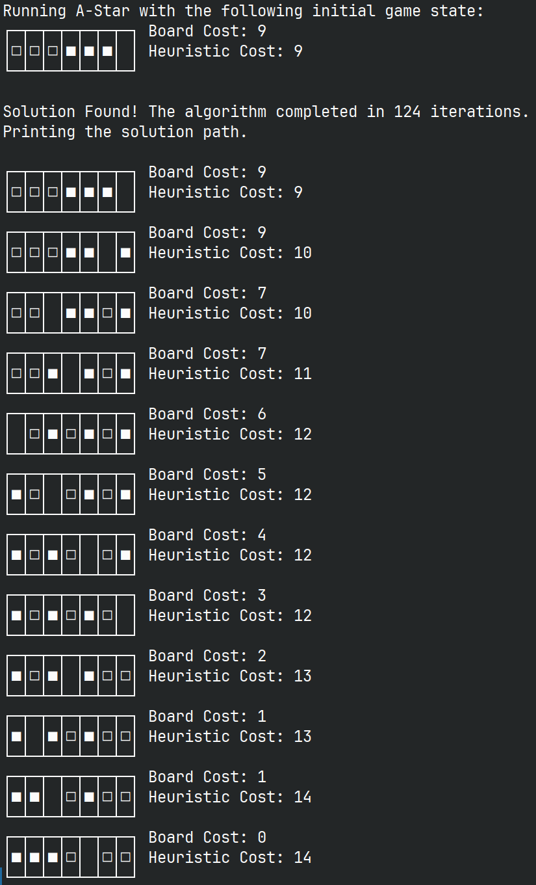
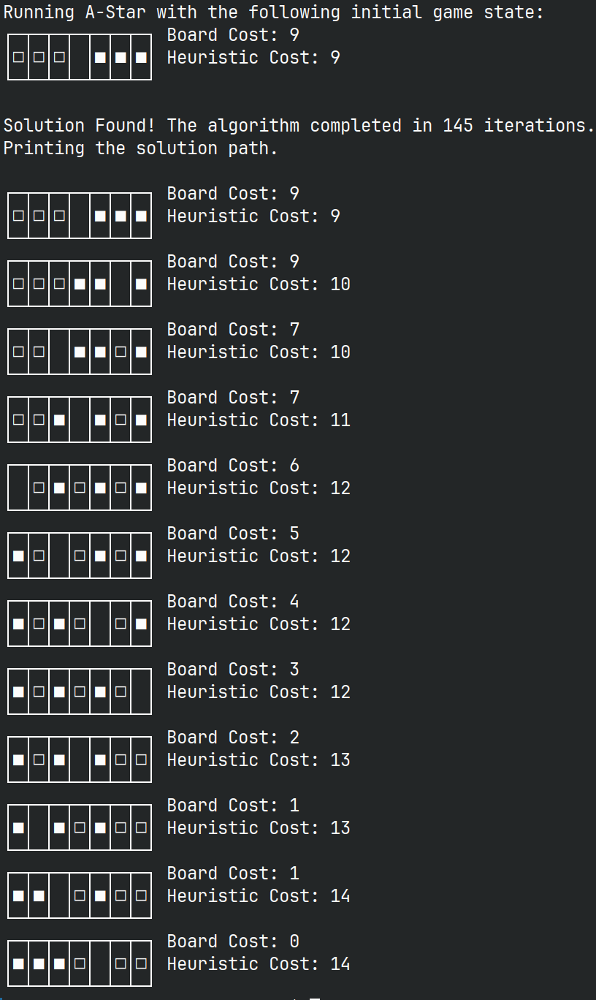
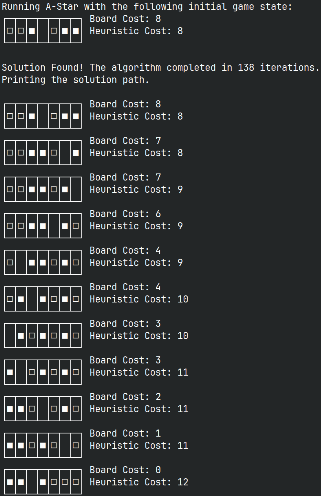
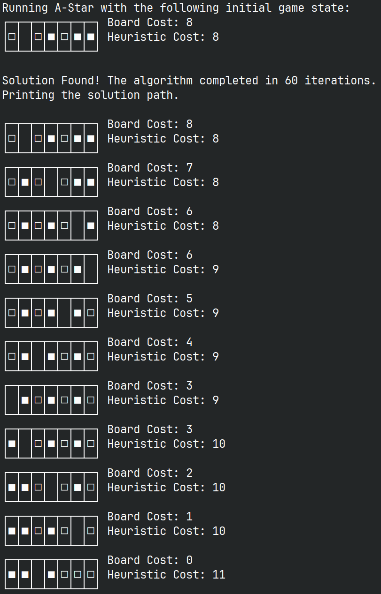
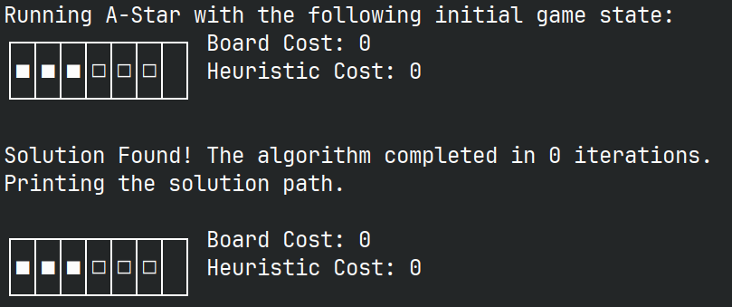

<!-- {width=3in} -->

\newpage

\thispagestyle{empty} \clearpage \tableofcontents \pagenumbering{roman}
\clearpage \pagenumbering{arabic} \setcounter{page}{1}

# Problem Statement

Given an initial configuration of a sliding puzzle and a corresponding possible
move-set, please solve the system in the most efficient way possible.


# System Definitions

In order to begin our approach to a solution, we must first define the system's
goal states, rules that can be applied to reach a goal state, and the cost of
completing any solution. After defining these parameters, we can then apply them
in the usage of the A-Star search algorithm to explore the solution space in a
way that guarantees the optimal solution, at the possible cost of time and space
complexity of the aforementioned solution space.

To reiterate the initial definitions that must be made:

- What is the system's goal state?
- What rules can be applied to current states to approach the goal state?
- What are the respective costs of moving between intermediate states?

## Definition 1 | What Are The System's Goal States?

In the problem, we are given an initial board state consisting of 7 spaces, 3 of
which are populated with black tiles, and three of which are populated with
white tiles. The remaining space is an empty space. The initial configuration
can be any permutation of the 6 tiles as long as they fit within the board. A
goal state is reached when the resulting board has all white tiles to the left
of all black tiles, regardless of the position of the empty space. `wwwbbb_`,
`wwwbb_b`, `wwwb_bb`, and `www_bbb` are all valid board states where `w`
represents a white tile, `b` represents a black tile, and `_` represents an
empty tile.

## Definition 2 | What Rules Can Be Applied To Intermediate States To Reach The Goal State?

According to the given system, there are two restrictions that have been
provided.

1. A tile may move into an adjacent empty cell with unit cost.
2. A tile may hop over at most two other tiles into an empty cell with a cost
   equal to the number of tiles hopped over

By taking these considerations into account, we can then generate a rule-set
that can be applied to an intermediate system state to approach the goal. The
rule-set that I generated is as follows:

1. A tile hops two spots to the right into an empty spot.
2. A tile hops over one tile to the right into an empty spot.
3. A tile slides to the adjacent right into an empty spot.
4. A tile moves to the adjacent left into an empty spot.
5. A tile hops over one tile to the left into an empty spot.
6. A tile hops over two tiles to the left into an empty spot.

Given an initial state of `bbb_www` we can show how each rule is applied to the
state.

First, a tile is selected (we will assume zero-indexed tiles, that is, the first
tile is tile 0) and then a rule is applied to that tile. This assumes all bounds
and error checking has been conducted prior to the operation.

- Rule 1 on Tile 0: `bbb_www` --> `_bbbwww`
- Rule 2 on Tile 1: `bbb_www` --> `b_bbwww`
- Rule 3 on Tile 2: `bbb_www` --> `bb_bwww`
- Rule 4 on Tile 4: `bbb_www` --> `bbbw_ww`
- Rule 5 on Tile 5: `bbb_www` --> `bbbww_w`
- Rule 6 on Tile 6: `bbb_www` --> `bbbwww_`

Applying these rules to the intermediate states, we can then generate any
possible permutation of of the game board.

## Definition 3 | What Are The Respective Costs Of Moving Between Intermediate States?

The cost for transitioning between a state of the current system is relatively
straightforward. However, the cost for transitioning between states is
independent from other cost factors that are used by the search algorithm that
is implemented. In this case, the A-star algorithm. For the implementation thus
far, we can only define the cost for applying a rule to our current system
state.

The costs for applying the rules are defined by the number of tiles the selected
tile to jump over. If the tile is not jumping over another tile, then the cost a
unit cost. As such, the costs for each rule application be be derived as
follows:

- Rule 1: 2 units
- Rule 2: 1 units
- Rule 3: 1 units
- Rule 4: 1 units
- Rule 5: 1 units
- Rule 6: 2 units

# Search Algorithm Definitions

## Search Algorithm Explanation

First, let us briefly explain the algorithm that is being implemented to find
the solution. The A-Star algorithm is implemented similarly to a breadth first
search with the addition of a heuristic measurement that limits the search space
to nodes with lower costs than the underestimation of the cost to find the
solution. This effectively reduces the amount of searching to only nodes that
are guaranteed to give a solution that is optimal. This of course, introduces a
large amount of space and time complexity due to the search space growing very
quickly as more permutations of the search space are added to the search space.
In the previous section, we defined system parameters such as the goal state,
the rules that can be applied to intermediate states, and the direct cost of
transitioning between goal states. With those definitions having been made, it
is now possible to design an implementation of an algorithm that utilizes system
parameters to search for a solution in the system state space.

In our case, we will be using an A-Star search algorithm implementation to solve
for the optimal solution at the cost of search time and space complexity.

## Definition of the Heuristic

When using the A-Star algorithm, a heuristic must be designed to determine the
cost of the current state, and the cost of reaching the current state. This can
be expressed using the function:

$$f(n) = g(n) + h(n)$$

Where $g(n)$ is the cost of the path from the starting node, $n$, and $h(n)$ is
a heuristic function that estimates the cost of the cheapest path from node $n$
to the goal. The goal of the A-star algorithm is to find a goal state with a
minimized $f(n)$.

In this case, there are three parameters that are a part of the function,
$f(n)$.

1. The level of the node in the search space, that is, the number of parent
   nodes that are traversed until the initial state is reached.
2. The cost of the board at any given state
3. The cumulative cost of the moves/rules that were applied to reach a given
   state.

In this case, the heuristic, $h(n)$ can be defined as the absolute cost of the
game board and can be used at the marker for the closeness to the solution. The
first two parameters can be considered the cost to reach the goal state and can
be summed together in their calculation thus rendering $g(n)$.

# Implementation Details

I decided to implement the solution using C++.

A `node` class and `search_algorithm` class were created in addition to a
driving main function.

The `node` class was tasked with the following:

- Storing board states.
- Storing children of a given board state.
- Storing the costs of each node at any given point.

The `search_algorithm` class was tasked with the following:

- conducting a search operation initial root node
- printing the solution when/if it is found.
- Implementation of the search algorithm
- Manipulation of the costs for the search heuristics.

## Methods For Each Class

Below are the methods implemented for each data structure that was used.

### Methods for the `Node` Class

- `void updateBoardCost()`: Calculates the sum of black tiles to the left of a
  white tile on the node's board and stores the result in the node's `boardCost`
  variable.

- `int moveTile(int tileIndex, int move)`: This function is called by the user
  of the nodes when a move wants to be made. Runs checks and returns the cost of
  the move that was made.

- `bool validateMove(int tileIndex, int move)`: Private class function that
  checks if the inputs to the `moveTile` function are a valid move and returns
  false if the move parameters are invalid.

- `int conductMoveOperation(int tileIndex, int move)`: After the move is
  validated by `validateMove`, this function conducts the move operation by
  moving board elements accordingly.

- `void incrementNodeCost(int cost)`: Increments the node cost according by the
  amount specified by the caller.

- `void printBoard()`: Prints the board state of the node.

- `void updateLevel()`: Traverses through the source node's parents until the
  root node is reached and counts how many nodes were traversed. This number is
  returned as the level of the node in the tree.

### Methods for the `search_algorithm` Class

- `Node *a_star_run()`: This class runs the A-Star algorithm and returns a
  pointer to the solution node.

- `int findMinCost()`: Returns the minimum cost in the open queue for the A-Star
  Algorithm.

- `vector<Node *> generateChildMoves(Node *currNode)`: Generate a vector that
  points to all nodes that are possible children of the input node.

- `void removeDupsInQueue(vector<Node *> *children)`: This function takes as
  input a vector of node pointers. The function checks if the vector contains
  nodes that have a board state that is already present in the open queue.

- `void removeDupsInTree(vector<Node *> *children)`: This function takes as
  input a vector of node pointers. The function checks if the vector contains
  nodes that have a board state that is already present in the solution space,
  that is, the tree that is generated by search algorithm.

- `Node *searchTreeForBoard(Node *input)`: This function takes as input a vector
  of node pointers. The function checks if the vector contains nodes that have a
  board state that is already present in the solution state space, that is, the
  search tree.

- `void showOptimalPath(vector<Node \*> solution)`: This function takes as input
  a vector of nodes and prints the contents of the node sequentially.

- `vector<Node *> generateSolution(Node *solution)`: Takes as input a solution
  node and generates a vector containing the pointers to of parents of each node
  up to the root node of the tree. This function then reverses the vector and
  returns the solution path from the root node to the solution.

## Code Compilation and Execution

### File Structure

The file structure is as follows in the base directory of the project:

```
.
|-- main.cpp
|-- Makefile
|-- node.cpp
|-- node.hpp
|-- search_algorithm.cpp
`-- search_algorithm.hpp
```

### Build System

### Compilation and Execution

The code can be compiled with a simple `Makefile` that compiles a binary called
`main`.

Running the following command from the project's base directory lets the user
compile the code and run the algorithm on any board state by entering the
initial board state as a string argument. The command below shows an example
using `wbbww_b` as an example.

```bash
make && ./main "wbbww_b"
```

If no board state is given as a string argument, then the default board state is
`bbbwww_` which is the board state given in the homework problem statement.

### Source Code

The source code can be found with the submission in addition to being hosted as
a `git` repository at the following link:
[https://github.com/aloretocornidez/579-principles-of-artificial-intelligence](https://github.com/aloretocornidez/579-principles-of-artificial-intelligence)

# Examples

Now that the project architecture has been explained in addition to the methods
to run the project, we can begin to show examples of the output of the program.
There will be 5 with varying inputs.

The heuristic cost is the initialized as the board cost and moves will change
the heuristic cost as they continue to solve the puzzle. This heuristic cost is
the sum of the board cost and the cost of the moves to reach the current state
from the root node.

\newpage

## Example 1

This is the first example. The board state is `BBBWWW_`, the board state given
in the problem statement. The initial board cost is 9 units.

{ height=512px margin=auto }

As you can see, the solution was found in 124 iterations of the A-Star algorithm
with a heuristic cost of 14 units.

\newpage

## Example 2

This is the second example. The initial board state is `BBB_WWW`, the same as
the problem statement with the difference being the position of the empty space
being in the middle of the board instead of the right side. The board cost is
also 9 units.

{ height=512px margin=auto }

As you can see, the program completed execution in 145 iterations with a total
heuristic cost of 14 units.

\newpage

## Example 3

For example three, the initial board state is `BBWEBWW`, the initial board cost
is 8 units.

{ height=512px margin=auto }

As you can see, the program completed execution in 138 iterations with a total
heuristic cost of 12 units.

\newpage

## Example 4

For example four, the inital board state is `BEBWBWW`, the same inital board
state as example three. The inital board cost is also 8 units.

{ height=512px margin=auto }

As you can see, the program completed execution in 60 iterations with a total
heuristic cost of 11 units.

\newpage

## Example 5

This is the fifth example. The initial board state is a solution to the game so
the board cost is 0 units.

{ height=512px margin=auto }

As you can see, there are no iterations completed by the serach algorithm and
the only node that is printed in the solution path is the inital node. Thus,
thus the heuristic cost is 0 units.

# Problem Statement Question Responses

Addressing items 1 and 2 from the problem statement:

```
You may use open and available AI tools to:

1. Solve this problem in the most efficient and optimal way.
2. Solve the solutions, and how the solutions were obtained, specifically:
   a. A heuristic is advised that you should explain in the material you hand in.
   b. An efficient search algorithm is advised that oyu should explain (how it
     works)
   c. attach the code that your generative AI has written for you or explain what
     off-the-shelf modules you have used.
```

I did not use AI tools in the generation of the code. After asking some of my
colleagues about their experience using AI tools, such as ChatGPT and Bard among
others, I was unfortunately not surprised to find out that the experience with
them was not great. While I have started to use the aforementioned AI tools in
other aspects of my education, such as explaining concepts at a general level, I
have not found AI tools be be helpful for solving problems that are not
extremely common and/or already implemented at a basic level. Asking for utility
functions such as traversing a linked list, or finding an iterator are sometimes
helpful, but it is honestly faster at the current moment to use an internet
search instead.

While the A-Star algorithm has many implementations that are public, especially
in python, they were not up to my standard of programming and seemed very
'hacky'. In fact, I am not satisfied with my implementation either, and given
enough time and resources, I would likely spend all of the time in the world
trying to improve it. However, as we know, time and resources are finite in the
world of engineering, and as such, I found that AI tools are not developed
enough to augment my programming experience at this moment, they instead wasted
my colleagues' time and I'm sure they would waste mine.

However, my approach to the solution may also not have been the most efficient
way either. My implementation was made in `C++`, and thus, the time to program
the solution was much longer than my colleagues' implementations which took less
than one month. However, if we look at the performance of the algorithms now
that they are both implemented, we can see that mine executes in approximately
14 milliseconds. My colleagues' programs had an average execution time of 859
milliseconds. In this case, the optimal solution depends on what factors you
choose to consider. Regardless, both of our programs arrived to the same
solutions, at least in regards to the heuristic costs of those solutions.

# Closing Remarks

This project was enjoyable to say the least. It gave me a change to explore
building a complex program in `C++` with multiple classes as well as routines
that run that are dependent on sub routines by other classes. For example, the
cost of the node's board being separate from the heuristic cost, each of which
were managed by different objects. Improvements could be made by implementing an
interface between the algorithm class that runs the A-Star routine and the cost
of the board. Implementing the interface would allow the routine to be
abstracted to more types of functions.

There were some issues that I ran into while implementing the solution. As you
can examine by looking at the source code, the program was implemented in `C++`,
thus, I had ran into an issue where removing duplicate nodes was not being
conducted properly. The A-Star routine was calling the functions to remove
duplicate nodes, however, the changes made to the vector in the removal
functions were not being propagated to the vector that was used as input to the
function call. As you can probably imagine, the issue was that the vector was
being passed in as a value and node removals were being made to a copy of the
vector instead of the original vector. It is easy to think that this issue was
obvious, however, when I was programming the solution, I was so worried about
bugs being in my implementation that a simple pass-by-reference bug went
completely over my head. I tell myself I love programming implementations in
`C++` so either I am a liar or a masochist, and I don't know which is less bad.

With the knowledge that I gained from implementing a simple A-Star search, I now
feel more prepared to implement a solution for the final project. My group is
also willing to work with my implementation as a base because we have agreed
that working with a strongly typed language may be better for complex programs
than working with the weakly typed `Python` language. In addition, now that the
base classes have been implemented, the implementation of the program itself
should not be as difficult to do since we are not starting from scratch.


